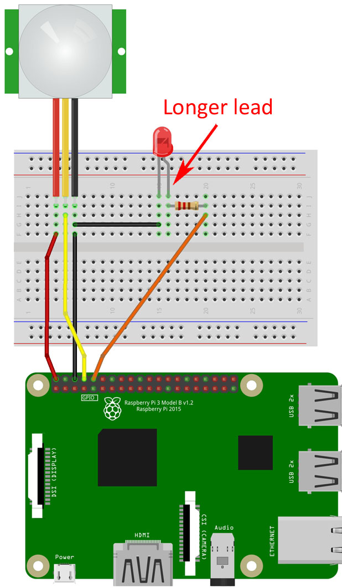

# PIR Sensor

## Materials
 - Raspberry
 - resistor
 - PIR Sensor (HC-SR501)

## Calibration
*turn the sensor so the white ball is facing downwards*

The HC-SR501 has a maximum sensing distance (detection range) of 7 meters. You can adjust the sensing distance by rotating the sensitivity potentiometer (on the left) CW or CCW. Rotating the potentiometer clockwise increases the sensing distance to a maximum of 7 meters. Rotating it counterclockwise decreases the sensing distance to a minimum of 3 meters.

The potentiometer on the right can be used to adjust the time that the output stays HIGH for after motion is detected. At a minimum, the delay is 3 seconds and at a maximum, it is 300 seconds or 5 minutes. Turn the potentiometer clockwise to increase the delay and counterclockwise to decrease the delay.

 ## Results
 Works when connected to 5V

Pinout(ignore led):

 

 ## Sources
+ [gpio library PIR example](https://gpiozero.readthedocs.io/en/stable/recipes.html#motion-sensor)
+ [Arduino sample project](https://create.arduino.cc/projecthub/electropeak/pir-motion-sensor-how-to-use-pirs-w-arduino-raspberry-pi-18d7fa)
