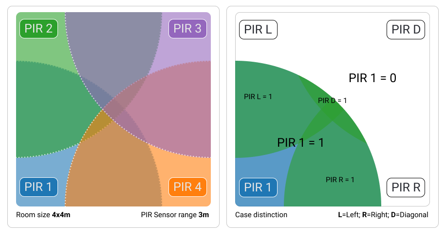

# Smart-Environment

Pinout:

## PIR Sensor detection cases

We want our nodes to communicate with each other and share their sensor inputs. By that, our assumption about a person's position is more precise.
For our test scenario we could simply mark a 4x4m square on the ground and place our edges entities with PIR sensors in each corner. Setting the detection range of the PIRs to their minimum of 3m and with the respective room size we can assure two things:

 - There is no blind spot in the center
 - We can distuingish fairly well between different input arrays

Given 4 PIR sensors we would have 24 possible input arrays. For our use case we can generalize every array in which our current Sensor doesn't detect anything (= 0) and set the light low and the speakers loud. The 8 remaining cases can be split up into two relevant ones regarding actuator control. The case where only the selected PIR sensor detects motion ([1,0,0,0], blue) or when anyone else also does so as well ([1,1,0,0], .. [1,1,1,1], green).

- White: Speaker Volume - high, LED - off
- Green: Speaker Volume - medium, LED - on
- Blue: Speaker Volume - low, LED - on, bright

## PIR vs. RCWL

Own measurements:

| Test:              | PIR:  | RCWL-0516   |  
|--------------------|-------|-------------|
| Range              | 7m    | 5m          |
| Trigger time       | ~3-6s | 3s          |
| Recovery time      | ~5s   | instant     |
| Beam Angle         | ~170° | ~300°       |
| Blocked by objects | Yes   | No          |
| Interference       | No    | Probably No |

Discussion:

The table shows the Results our own measurements. Range is self-explanatory. **Trigger time** is the time for which the sensor sends a HIGH signal. **Recovery time** is the time the sensor needs before being able to perform another measurement. **Beam Angle** is the maximum angle at which measurements can be performed. The RCWL had almost a perfect sphere for its measurement beam although there is a small deadzone on the backside where the pins are. **Blocked by objects**: The radiosignal from the RCWL capable of penetrating most materials and is therefore not blocked by most objects. **Interference**: Since the RCWL uses radiofrequencies for measurements, interference is a concern. However, strong 5GHz/2.4GHz wifi signals did not result in any problems. Running an old microwave did result in false triggers, but only when the sensor was practically touching the microwave door.
