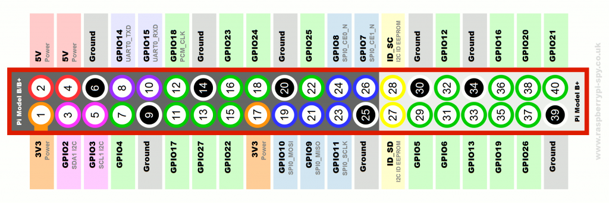

# Smart-Environment

The Backup-Image of our 32GB-microSD Raspberry Pi can be accessed [here](https://syncandshare.lrz.de/getlink/fiwgxS6iyv6p68UEvT4sHEg/PiSDCardBackup.dmg.zip). Password available upon request.

Summarizing presentations about our kick-off, sprint and final demo meeting can be found on [Google Drive](https://drive.google.com/drive/folders/1RWxR8SE-929bHdC6CXpxWIwu3TBD98dn?usp=sharing)

### Raspberry Pi Pinouts:

To connect actuators such as LEDs to our RPis we had to be familiar with the GPIOs pins.

### Directory Layout
    
    ├── PIR_sensor                    # Testable python-script and instructions to connect PIR sensor to RPi
    ├── RGB LED                       # Testable python-script and instructions to connect RGB LED to RPi
    ├── camera                        # Localization logic that holds testable script to test camera module
    │   └── motion-detection          # Setup of the camera module, opencv and first motion detection
    │       └── raspi-camera-stream   # Motion detection and tracking using a continuous video stream from RPi
    ├── mesh-network                  # Set up of mesh network
    ├── microphone                    # Testable python-scripts and instructions to connect mics/sound sensors
    ├── music_sync                    # Clock synchronization
    └── node-red                      # Node-RED flows
    
  

