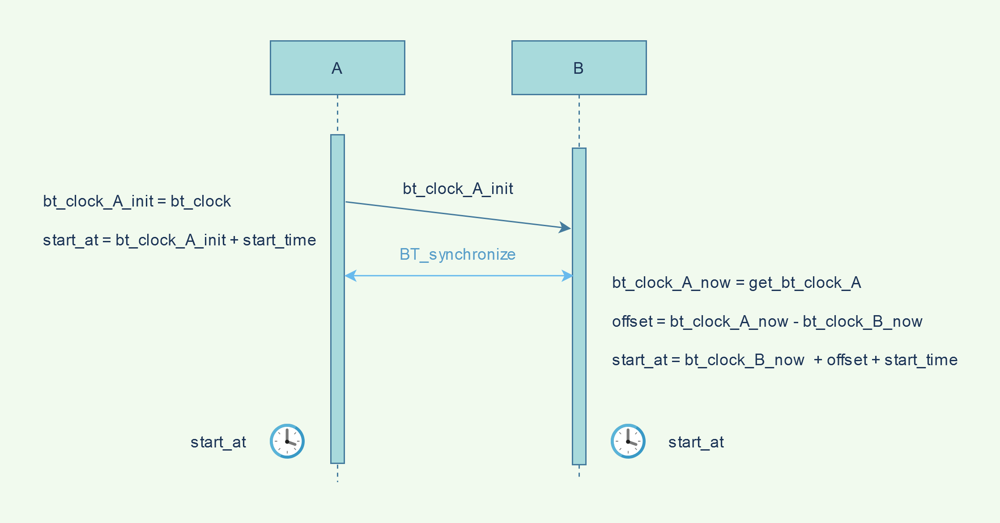

# Bluetooth clock Synchronization

# About
The code in this folder uses bluetooth clocks to synchronize the system clocks and run tasks like music playback and led flashing perfectly synchronous. There are 2 partners for this protocol, A and B. The process of execution is described in the diagram below.


# Perequisites 
 ```sudo apt install libbluetooth-dev```
 
 ```sudo apt install wiringpi```
 
# Overview



## Wiring
The Code connects the LED to WiringPi pin 0 which is GPIO17 on the Raspberry Pi 3/4.

## First step pair and trust the devices
1. ```sudo bluetoothctl``` in both devices 
2. In device A enter ```discoverable on``` and ```pairable on ```
3. In device B enter ```scan on``` and wait for the raspberry to appear. Then enter ```scan off```
4. In device B enter ```pair *BT_ADDR*``` and then pair the device. Then enter ```trust *BT_ADDR*```
5. In device A enter ```devices``` and copy the BT_adress of the other raspberry. Then enter ```trust *BT_ADDR*```

Done. Now the devices are paired even after reboot.

## Compilation and execution 
FIRST REMEMBER TO STOP NODE RED AS IT WILL INTERFERE

Compile the files named bt_sync_B.c and bt_sync_A.c using the command at the top of the file after the imports and macros. It will look something like this 
```gcc -o bt_sync_X bt_sync_X.c -lbluetooth -lwiringPi```. 

Then you can execute the binaries. For this you need to first run the B Partner as it will open the socket. 


For partner B the parameters are like this: ```bt_sync_B *ARBITRARY_PORT* *BT_ADRESS_OF_PARTNER* ``` where ARBITRARY_PORT is any port you like e.g. 1234, BT_ADRESS_OF_PARTNER is the bluetooth adress of raspberry A. You can get this adress by running ```sudo hcitool device``` on raspberry A.
  
  
For partner A the parameters are like this: ```bt_sync_A *PARTNER_IP* *PARTNER_PORT*``` where PARTNER IP is the ip of raspberry A and PARTNER PORT is the port you specified in the step above.

Thats it!
